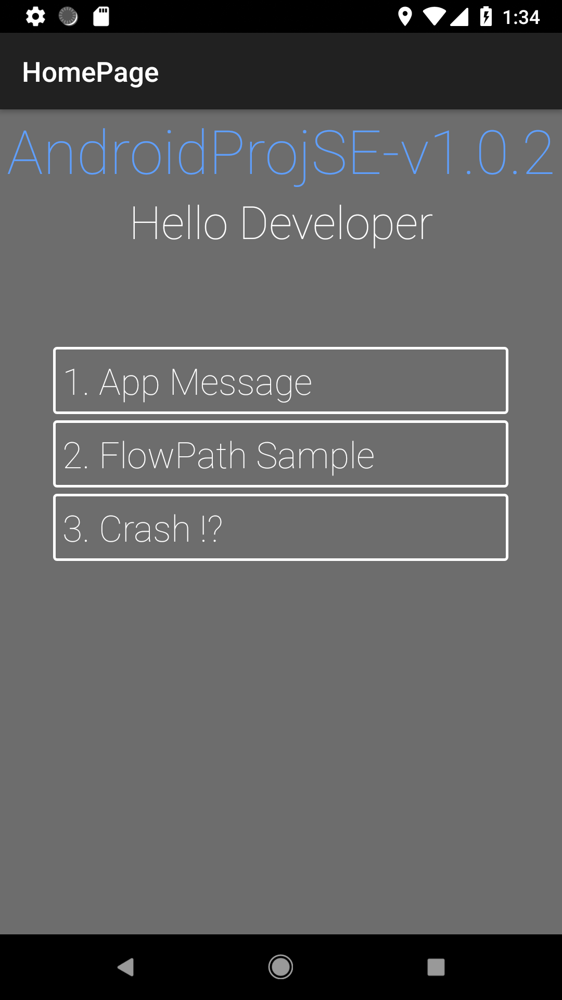
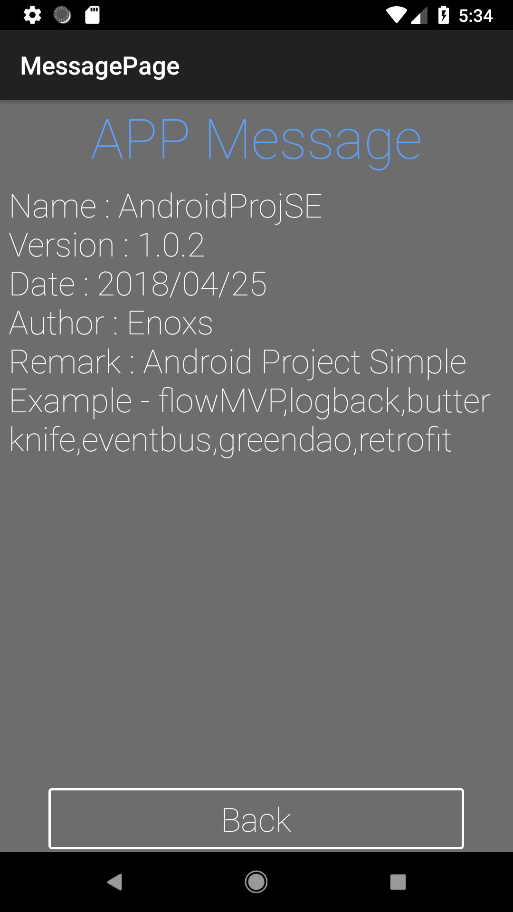
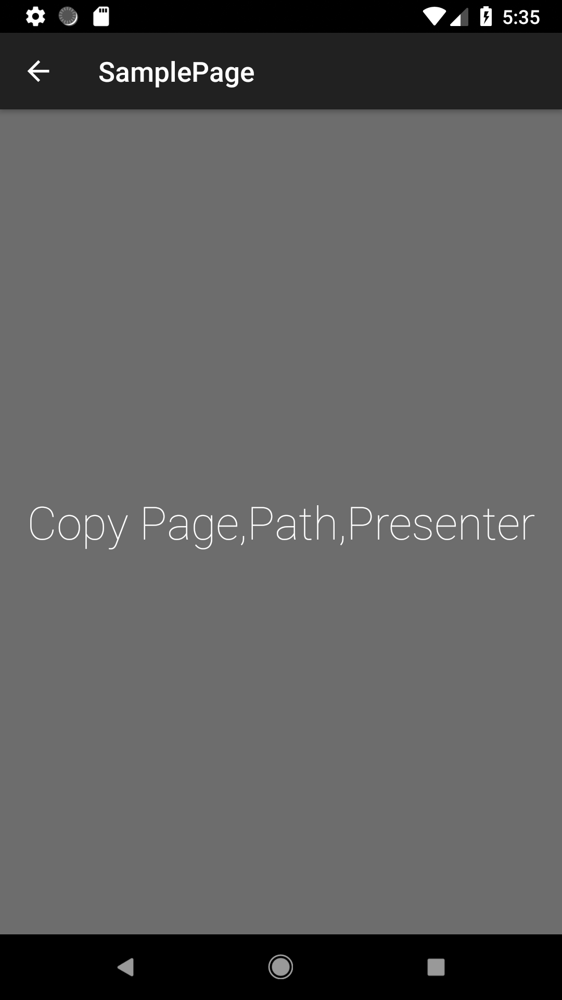
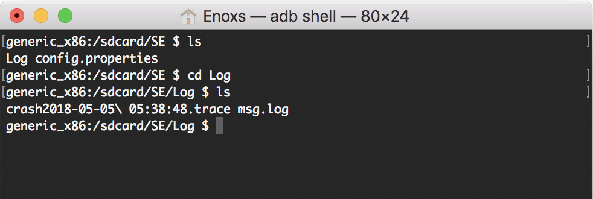
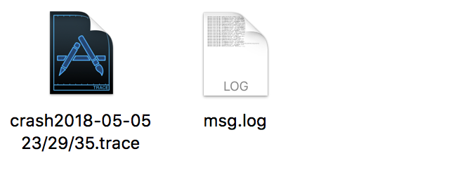
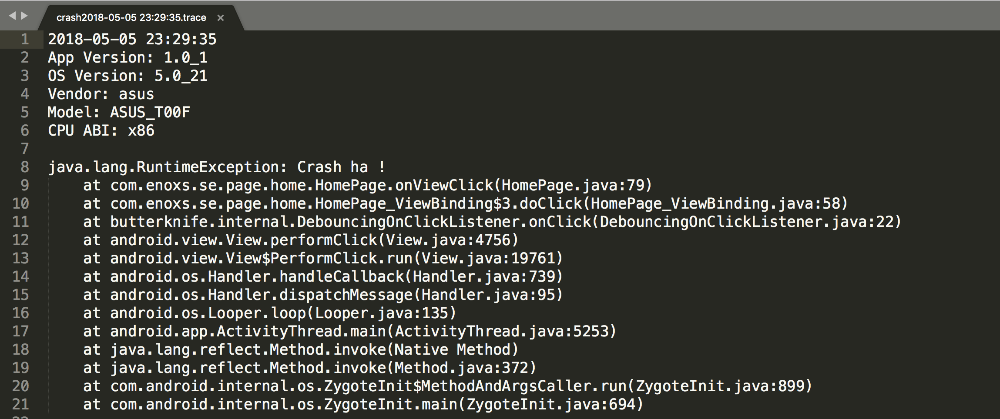
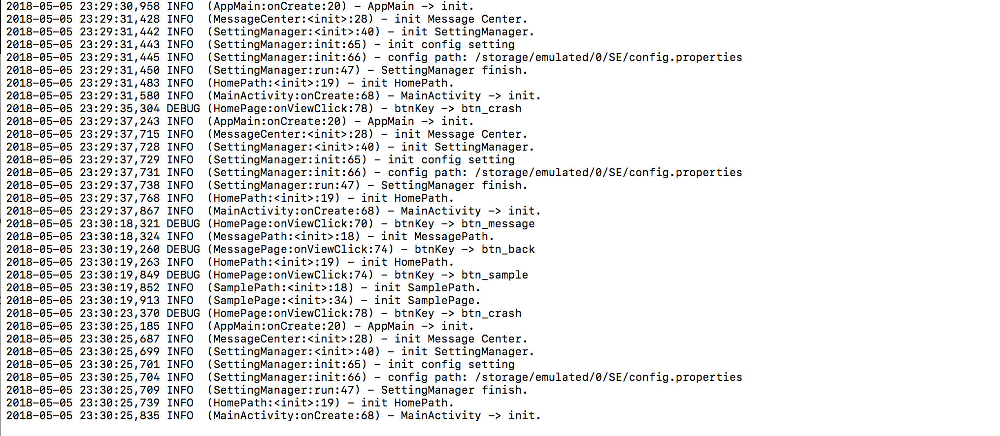
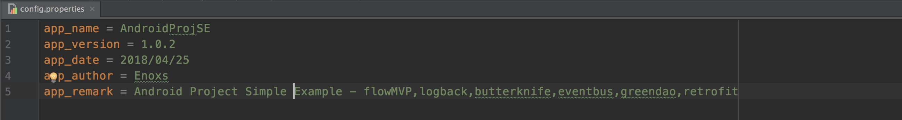

# AndroidProjSE-v1.0.2

使用 Square's Flow 的 MVP 設計模式呈現畫面，於啟動時以執行緒
(CrashHandler) 監控程序是否發生崩潰，於發生崩潰時紀錄日誌與重啟應用，一般的日誌以 logback 工具紀錄。 

讀取於 res/raw 中的 config.properties 檔案，將取得資訊封裝為物件，使用 EventBus 發送至訊息中心(MessageCenter)，頁面中的
Presenter 於初始化時發送請求至訊息中心交換。

第三方
------

### FlowPath MVP
+ <https://github.com/tuvvut/FlowPathSample>

### butterknife
+ <https://github.com/JakeWharton/butterknife>

<table>
    <tr>
        <td width="20%"></td>
        <td width="20%"></td>
        <td width="20%"></td>
    </tr>
<table>

### CrashHandler
### logback

+ <https://github.com/tony19/logback-android>
+ <https://blog.csdn.net/singwhatiwanna/article/details/17289479>

<table>
    <tr>
        <td width="20%"></td>
        <td width="20%"></td>
    </tr>
<table>

#### msg.log and crash.trace                                  

<table>
    <tr>
        <td width="20%"></td>
        <td width="20%"></td>
    </tr>
<table>

### Load config.proerties

#### EventBus

+ MessageCenter exchange App config information
    + <https://github.com/greenrobot/EventBus>

<table>
    <tr>
        <td width="20%"></td>
    </tr>
<table>
